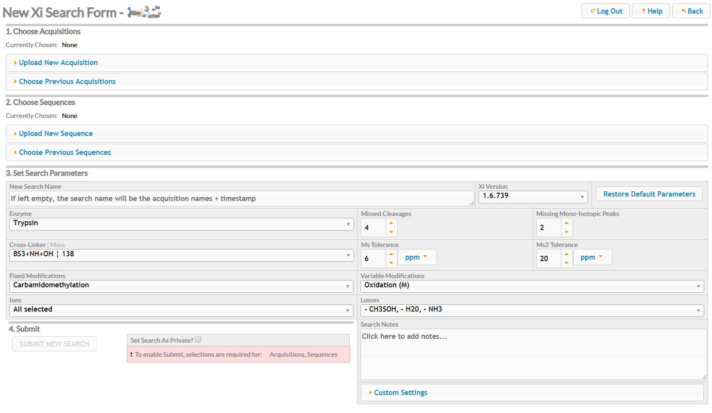
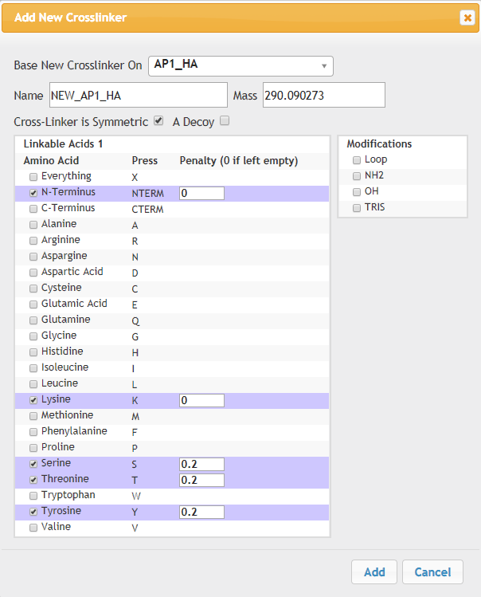

## Xi Search Submission Page ##

The Xi Search Submission Page is the mechanism through which new searches are specified and passed to Xi. The page is broken into 3 logical steps (4 including the final Submit action). The sections below describe what each step does and how to complete it.

### 1. Choose Acquisitions ###
Acquisitions may be included in a new search in two ways.

1. Construct a new acquisition to be uploaded to the Xi Database and then used in a search.
2. Choose from a list of previously uploaded acquisitions. Depending on your profile rights, you may see only your own previous acquisitions or those uploaded by other users too.

#### Upload New Acquisition ####
Open the section labelled *Upload New Acquisition*. A small form will appear. Three actions need to be completed before the upload is ready to start.

1. Pick and enter a name for the acquisition you are uploading. Choose something that's descriptive of the data you are going to upload.
2. Press the *Add Files* button to open a file dialog to choose one or more files to be parcelled up into this acquisition. Xi currently supports .mgf, .msm, .apl and .zip files and so you are limited to selecting these types of file. Once you have chosen your files they will be listed below the form.
3. Decide whether you wish this upload to be private to yourself by ticking the *Set Upload To Private* checkbox.

Once steps 1 and 2 have been completed to the form's satisfaction the *Start Upload* button will be enabled. Press this to start the upload. Progress bars will then show the upload completing, and upon completion, the files will be relisted as "Uploaded". A text box will also appear under the *Choose Acquisitions* label to indicate this upload has been automatically added to the current set of chosen acquisitions. The close button in the text box will uninclude it.

This section will also alert the user if they are trying to upload a file with the same name as one that has already been uploaded. It will not prevent the upload (as obviously they may well be different in content), but will ask the user to check if perhaps the acquisition they're wanting to upload may already be present, by looking in the "Choose Previous Acquistions" section, which is described next.

#### Choose Previous Acquisitions ####
Open the section labelled *Choose Previous Acquisitions*. This, with restrictions according to your user profile, reveals a paged table of previous acquisition uploads to choose from.

The table is sorted by *Id* by default, which produces an identical ordering to sorting the table by *Date*. The table can also be sorted by other metadata: *Name*, *User*, *Files*, or *#* (File Count); and pages can be navigated using the number input and arrows next to "Page Number".

Like the history page, the table has a filter associated with each column. These can be used to find specific acquisitions when you know their attributes, or are searching for acquisitions with given attributes. The filters are conjunctive, so only acquisitions that match all the filter conditions will be shown. Multiple entries, separated by spaces, can be entered in individual filters and the table will only return those that match all for that column (i.e. conjunctive again). The one quirk here is that as the *#* column is a number, then two numbers entered here act as a range e.g. typing "3 12" will return acqusition with between 3 and 12 files inclusive.

Tick the checkboxes in the *Choose* column to choose one or more acquisitions. Choices made here will be added to the collection of text boxes under the *Choose Acquisitions* label. Untick the checkboxes in the *Choose* column or press the close icons in the textboxes to remove a choice.

### 2. Choose Sequences ###
The *Choose Sequences* step is equivalent to the *Choose Acquisitions* step except for these differences:

1. Only one file can be associated with a new sequence upload.
2. Sequence uploading accepts .fasta or .txt files.
3. The table in *Choose Previous Sequences* lacks a File Count column as the count is necessarily always 1.
4. The same table has a *Download* column where sequences can be downloaded to your local computer, dependent on user permissions.

### 3. Set Search Parameters ###
This step involves setting the following parameters for the new search:

* Name (optional)
* Cross-Linker
* Enzyme
* Ms Tolerance
* Ms2 Tolerance
* Missed Cleavages
* Missing Mono-Isotopic Peaks
* Fixed Modifications
* Variable Modifications
* Ions
* Losses
* Search Notes (optional)

*Name* is used in the search listings in the [Xi Search History](../history/index.html) page. Choose a name that reflects the search, otherwise it will default to concatenating all the chosen acqusition names along with a timestamp.

*Cross-Linker* is initially a single-choice option that can be changed to allow the selection of multiple cross-linkers for the search. Click "Allow Multiple Selections" in the dropdown to allow this.

*Enzyme* is by default a single-choice option. Use the radio buttons within the drop-down to make your choice.

- Alternatively, press the "Construct Sequential Digestion" button in the dropdown to make a digestion composed of more than one enzyme. Here, add new steps with the "Add New Digestion Step" button and then choose the enzyme for that step through a drop-down. Set local Missed Cleavages settings by checking the "Local MC" checkbox for the step and entering a value in the revealed number input - if unset, that step will use the global Missed Cleavages setting. Steps can be deleted (if more than one) by pressing the button marked with an 'X', and reordered by dragging the 'double-arrow' icons. "Revert to Single Enzyme Choice" will return to the single enzyme selection state.

*Ms Tolerance* and *Ms2 Tolerance* are numeric inputs and also have a choice of units (parts per million or Daltons).

*Missed cleavages* is a numeric input with no units and a default value of 4.

*Missing Mono-Isotopic Peaks* is a numeric input with no units and a default value of 2.

*Fixed Modifications*, *Variable Modifications*, *Ions* and *Losses* are all parameters for which multiple choices can be made. Select as many options as the search requires using the checkboxes in each parameters' drop-down menu. *Ions* has the extra restriction that at least one of the options must be chosen.

*Search Notes* can be used to add more information about the search, useful as a memory aid for later. The *Custom Settings* textbox is really only used by the Xi Database Admin to set custom flags to a search, and not intended for general use.

To reduce user input fatigue a set of sensible defaults are displayed, so you only need to change the ones that are unsuitable for your new search. These defaults can be restored using the *Use Default Parameters* button. The parameters from your last search can be reapplied using the *Use Your Last Search Params* button. 

### 4. Submit ###

If the previous steps have been completed, then the *Submit New Search* button will be enabled and the neighbouring warning message will have changed from red to green. If there are still uncompleted parts of the page the warning message will still be red and list the missing information types.

Choose whether you wish the search to be private using the *Set Search As Private?* checkbox. This acts in a similar manner to the private acquisition and sequence upload options, in that a private search will only be visible to you and Xi administrators.

Once happy with the choices made on the page, press *Submit New Search* to register and start the search on the Xi Search Engine. You'll then be directed to the [Xi Search History](../history/index.html) page where its progress can be monitored, or another new search begun.

### Addendum ###

#### Add New Crosslinker ###

The *Cross-linker* selection has next to it, with the usual caveat of user permissions, an option to allow the creation of a new cross-linker. Click the *+ New* button to bring up a dialog like that seen below:

Here, there are options to give a new crosslinker a name, a mass and a type (asymmetric / symmetric).

Asymmetric crosslinkers will show two lists of amino acids and end terminals which can be selected for inclusion as possible sites for crosslinking. Selected amino acids can also be given a penalty score (0 as default).

Symmetric crosslinkers will show one list and a small table of modifications that can be selected.

When the mouse pointer is inside an amino acid table, the border will highlight in blue, and pressing keys corresponding to the amino acid codes in the *Press* column will check/uncheck those amino acids. This is often quicker than selecting individual checkboxes by mouse.

To make things easier, an existing crosslinker can be used as the basis for the new crosslinker. Select one from the "Base New Crosslinker On" drop-down. Mass, type and selected amino acids will be copied over. At the moment this doesn't handle photoreactive crosslinkers and other edge cases. Make sure to explicitly change the details that need changing (mass usually).

Once happy with the set-up of the cross-linker, select *Add* at the bottom of the dialog to add the new cross-linker to the database (or *Cancel* if you choose not to).

