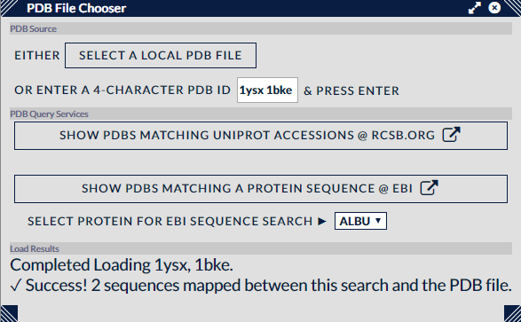

## PDB Data ##

The PDB File Chooser is a dialog that offers the opportunity to load in PDB structures either from a local PDB file or by using one or more PDB codes to download structures from the RCSB Protein Data Bank.

Once a file has been selected or a valid selection of PDB identifiers has been entered, the tool will, via NGL, load these structures and report back on how many sequences it has managed to align between the current search and the sequences in the PDBs. Alignment is performed automatically so discrepancies between search and PDB sequences are accounted for.

If sequences have been aligned successfully they can be inspected in the [Alignment View](../views/alignment.html). Also the [3D (NGL)](../views/3dngl.html) option in the View menu will now be enabled, and distance information will be available to plot in the [Histogram](../views/histogram.html) and [Scatterplot](../views/scatterplot.html) views.

If you are unsure which PDB is best suited for the current search there are a couple of options available as buttons which launch external web queries:

1. Show PDBs matching Uniprot Accessions @ RCSB.Org
1. Show PDBs matching a protein sequences @ EBI

The first will query RCSB as to which PDBs cover *any* of the uniprot accession numbers currently assigned to the proteins. This will return an ordered list of hits, of which the best ordering is typically "Residue Count: Largest to Smallest".

The second will populate an EBI web service page with a chosen protein's details - use the associated drop-down to pick which. (The RCSB has a similar service but returns the results in a format that's unsortable by an end user.) The external web page will then display the PDBs whose sequences most closely match the protein sequence. This can take a while, maybe up to a minute or so.

