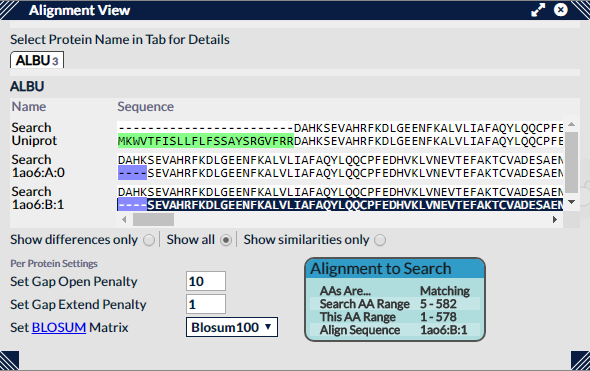

## Alignment View ##

Search sequences in the search data can often be slightly different from the sequences for the same proteins in the Uniprot database, and often radically different to those in PDB files for the same proteins. These differences are usually due to missing end and start sequences but can also include residue differences within the sequence and misalignments. Xi View automatically aligns these different sequences so Uniprot annotations appear in the correct place and cross-links in the 3D view are correctly positioned. This view displays the results of these alignments for user inspection along with some controls for tweaking the alignment algorithm (Gotoh) used.

### Representation ###

The search protein set is displayed as a set of tabs at the top of the view. Upon selection of one of these tabs, the protein it represents and the sequences associated with it are shown below the tabbed section. Each uniprot or pdb sequence is paired with the search sequence for that protein and the alignment showed as a pair of text strings. Colouring is used to represent differences between the two sequences, which can be either:

* Matching - no colour
* Different - orange
* Missing (in the search sequence but not the compared sequence) - blue
* Extra (in the compared sequence but not the search sequence) - green

### Interaction ###

Proteins are selected by clicking one of the named tabs at the top of the panel - this will then populate the rest of the panel with that protein's information.

Moving the mouse over a Uniprot or PDB sequence will reveal details of a part of the sequence which is matching, missing or extra to the search sequence. Often, sequences are too long to view wholly within the panel so a scroll bar is provided to access the full length of the sequences.

### Options ###

If more than one protein is present, the tab section of the panel will include a dropdown with options for sorting the tabs. These options being:

* Sort by protein name
* Sort by number of aligned sequences
* Sort by the total score of aligned sequences

Beneath the section that displays the current protein's sequence information is a trio of radio buttons for controlling the display of the residues in the sequence pairs. The options being

* Either the entire sequences can be shown ("show all")
* Only the matching portions of the sequences ("show similarities only")
* Only the different portions of the sequences ("show differences only").

Resulting elided sections of the sequences are replaced with a sequence of quotation marks, whose length is logarithmically related to the length of the elided section, e.g. "" represents 10-100 elided residues.

At the bottom of the panel are three controls for tweaking the Gotoh alignment algorithm. Both the "Gap Open Penalty" and the "Gap Extend Penalty" quantities can be changed, along with the Blosum matrix type the alignment scoring is derived from. These changes are local to the protein currently under examination in this view.

