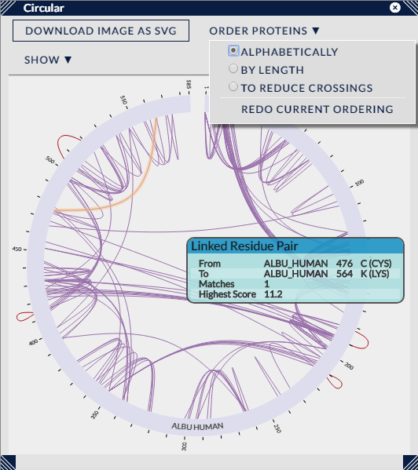

## Circular View ##

This view uses a version of the popular Circos layout to display the Cross-Links. Proteins are arranged around the circumference of the circle and cross-links are shown connecting proteins at the appropriate positions.

Like the other views in Xi View, individual cross-links can be highlighted by moving the mouse pointer over them (plus a tooltip supplies details on the particular cross-link). Similarly, cross-links can be selected by using the left mouse button. In conjunction with the CTRL key, multiple cross-links can be selected (by clicking on unselected links) and currently selected cross-links can be unselected.

Highlighting and selecting can also be performed on the protein representations. Here, selecting a protein will also select all the cross-links that connect to it. Again, in conjunction with the CTRL key, multiple proteins can be selected and deselected.

Clicking with the left mouse button on the background of the view will clear all selections.

### Options ###

There are two drop-down menus present that can affect the visual presentation of the cross-links in the circle view.

The first, "Order Proteins", decides the ordering of proteins around the circumference and as such is useful for multiple protein searches. The proteins may be ordered either alphabetically (default), by sequence length, or using an algorithm intended to set the protein ordering to reduce visual crossings in the display (this necessarily only reduces crossings of between cross-links, self cross-links are at set positions within a single protein).

The second drop-down menu, "Show", toggles on and off a set of visual preferences. These are:
1. All Proteins - for searches with many proteins the circular view can become crowded. This options dynamically removes proteins which have no cross-links that pass the currently set filter. The drawback is that changing the filter will then relayout the view i.e. proteins will very much not tend to stay in the same position.
2. Residue Labels (If Few Links) - if only a small number of cross-links are currently displayed (around 20) then the amino acid letters can be shown at the ends of the cross-links.
3. Self-Links on Outside - self links can be moved to the outside of the protein circle, leaving only between links in the interior of the circle.
4. Links With Overlapping Peptides Opposite To Self Links - a.k.a. homomultimers... whichever side (in/out) self-links are displayed on, checking this setting will show homomultimeric cross-links on the other side.

There is one remaining button which sits by itself, "Download Image as SVG", which will download an SVG (vector format) file of the current state of the circular view. The filename will include information on search id and current filter settings.

Lastly, like the other views that sit in sub-panels, the circular view can be resized by clicking on and dragging its corners, and repositioned by clicking on and dragging the title bar. The view can be closed using the X button next to the top right-hand corner.

