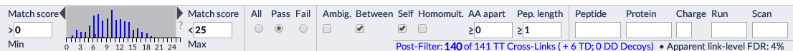

## XiNet View ##

At the bottom of the xiView results visualisation page are a bar of controls for filtering the data. Working from left to right, these fall into the following subsections:

- Cut-Off
- Pass / Fail Threshold
- Cross-link attributes
- Match Attributes
- Summary

#### Cut-off ####

The first filter sub-section allows the upper and/or lower score cut-offs for the matches to be set. These can be done by entering text in the input fields or dragging on the histogram to select a range.

Note that the contents of the score histogram shown here is not affected by other filter settings; to see a histgrom of scores post-filtering open the [Histogram View](./views/histogram.html "Histogram View").

(martin, I put it before the pass / fail threshold controls cause I thought it might make people less likely to expect the histo to change. Maybe does look weird not having threshold first. Also, there's still an unresolved issue here for xiview to do with things having multiple sets of scores...)

#### Pass / Fail Threshold ####

Radio buttons that allow all matches, only those where the 'pass threshold' attribute (as read from the uploaded data) is true, or only those where it is false.

#### Cross-link positional categories ####

These controls allow including or excluding categories of cross-links which are defined on the basis of link position. These categories are:
- Ambiguous - include/exclude cross-links which have an uncertain position due to peptide-level ambiguity (i.e. ambiguity as in the protein identification problem)
- Between - include/exclude cross-links that are between different protein
- Self - include/exclude cross-links between instances of the same protein; note - these cross-links are not necessarily intra-molecular and we avoid using the word 'intra' in this context.
- Homomultimeric Links? - this is a sub-class (its not treated as such in interface so this confusing) of Self links in which
- AA apart - exclude Self Links with fewer than the specified number of amino acvids separating them in the sequnece.

(Looking at it, I now think Pep Length might be in wrong place as its more an attribute of matches and the others are all positional attributes of cross-links).
Now also think homomult in wrong place as the overlapping peptides it refers to are associated with specific match

### Match Attributes ###

PROTEIN should be in 'cross-link positional'?

### Summary ###

In the bottom right of the screen is summary information on the number of cross-links that passed the filter. If decoys were included in the uploaded data then totals will be provided for the number of target-target, target-decoy, and decoy-decoy cross-links passing the filter. For fun, an 'apparent link-level FDR' is displayed based on these totals.  
