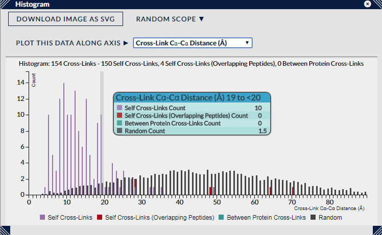

## Histogram ##

The histogram view displays the distribution of a selected meta-data attribute across the current filtered cross-link and match population. 

### Representation ###

The histogram automatically chooses a reasonable number and range of intervals to aggregate the data over and display (up to 100), and the categories shown in the chart are taken from the current colour scheme if a discrete scheme (i.e. non-continuous and with a few separate categories), otherwise it reverts to the default self / between / homomultimeric cross-link categories.

### Interaction ###

Moving the mouse pointer across the histogram display details for those cross-links or matches in the interval under the pointer, and also highlights them in other active views. Left-clicking the mouse will then select those cross-links or matches, and when used in combination with the CTRL key performs an additional toggling functionality on the current selection. Selected cross-link/matches are displayed in the histogram as hatched yellow bars, showing the total for each interval in the current chart.

The series legend at the bottom of the chart can also be used to turn on or off the display of individual series within the chart.

### Options ###

The main control for this view is the "Plot this Data Along Axis" dropdown which chooses the metadata attribute to be distributed in the histogram. The availability of these attributes fundamentally depends on the contents of the loaded search data though additional metadata can be added using the Load > Cross-Link Metadata dialog available through xiVIEW's top menu bar.

If a PDB file has been loaded, then the Cross-Link Distances are available to plot as one of the options. With this attribute a sample distribution of potential distances from the PDB is also plotted (as the "Random" series in the chart) to show users whether their cross-link distances are differentiable from background noise. Also, a further dropdown becomes available, "Random Scope", which allows a user to select the range from which these sample distances are taken - from anywhere within the full PDB, from only within copies of the same proteins in the PDB, or only from within only the same chains in the PDB. This option can produce large changes in the sample distribution - with samples taken only from within the same chains typically having much smaller average distances. If crosslinker specificities are available then the random distances are chosen only between cross-linkable residues.

The random distances are also affected by two settings in the 3D View. Random distances will only be selected from within the current assembly, and also never between PDB models if "inter-model distances" is not checked. This can be verified by changing these settings in the 3D view, and if it affects the possible links the randoms can be chosen from it will automatically change the random distribution here.

As in other views, the "Download Image as SVG" button will download an SVG (vector format) file of the current state of the view. The filename will include information on search id and current filter settings.

