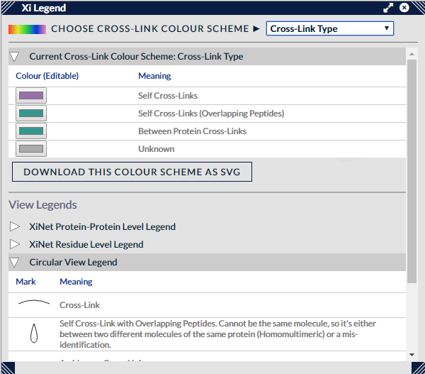

## Xi Legend View ##

This view shows controls for changing and setting the active colour scheme used across the views, along with a set of legends, one per view, to show the visual representations used in the Xi views and what they mean.

### Options ###

The top control, the dropdown "Choose Cross-Link Colour Scheme", is used to select the current colour scheme, of which there are four defaults:

1. Cross-Link Type - colour links by between, self or homomultimeric status
2. Protein-Protein Colouring - for small collections of proteins (up to 5) this will generate a unique colour for each possible protein-protein combination a between cross-link could have.
3. Group - for aggregated searches, each cross-link will be assigned a group colour if it is unique to that search group, otherwise, if it is common to searches in more than one group, given a default "Multiple Group" colour. 
4. Distance - when a PDB file is loaded, this colour scheme can be used to discriminate 'within distance', 'borderline' or 'overlong' cross-links. A range slider is also available in this scale to change the cutoff values.

Other colour schemes become available when loading cross-link metadata. Each non-positional column in a cross-link metadata file will be converted to a colour scheme if possible, most usually to a scale between the minimum and maximum values in the column.

Once selected, the details of a colour scheme appear underneath the dropdown in the section marked "Current Cross-Link Colour Scheme". Within this is a small table of colours and a description of what values/categories of cross-link they represent. Generally, these colours are editable - clicking on the small coloured swatch in the Colour column will bring up a widget to change the colour for that category/value, and this change will be seen in any active Xi views. Some colour schemes are uneditable - those that have a specific colour set for each cross-link, though none of the default colour schemes come under this category.

Underneath this section is a button, "Download This Colour Scheme as SVG", which saves the colour scheme as a legend in a vector format (SVG) that can be used to complement previously downloaded figures - as long as they use the same colour scheme.

The last part of the view consists of a section headed "View Legends" that includes a set of expandable/collapsible tables, each of which contain the legend for a particular view. These legends are deliberately mainly monochromatic - mostly the colouring will be decided by the colour scheme selection above - these sections rather describe the style of marks used to represent cross-links and other elements within each view.

Lastly, like the other views that sit in sub-panels, this view can be resized by clicking on and dragging its corners, and repositioned by clicking on and dragging the title bar. The view can be closed using the X button next to the top right-hand corner.

