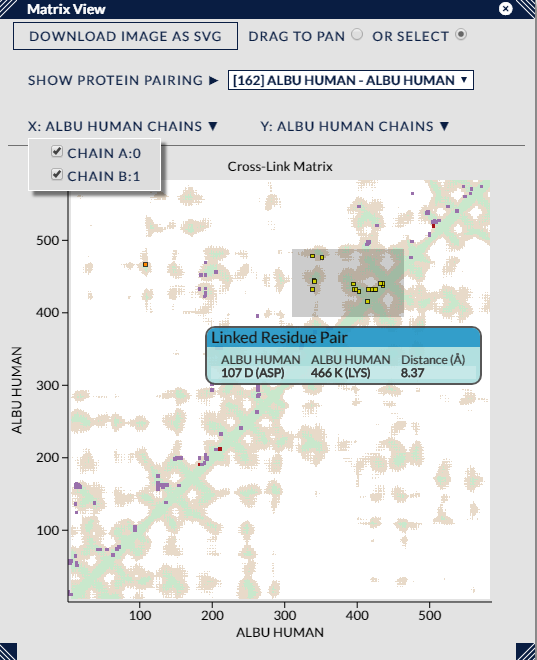

## Matrix View ##

The Matrix View (aka a Contact Map) lays out a pair of proteins along the X and Y axes of a matrix and plots points where the row and column of the linked residues of a cross-link intersect. e.g. if a cross-link went between Protein A at Residue 200 and Protein B at Residue 100, a matrix view between Protein A and B would plot a point at the coordinate (200,100).

The matrix is extremely useful for exploring dense areas of cross-linking that could be impenetrable in other views. In addition, when a reasonably sized pdb file is used, full distance information can be plotted in the background of the matrix, enabling cross-links to be seen against this context.

The cross-links within the matrix are coloured with the current colour scheme, and a tooltip will show information on any cross-links within a small distance of the mouse pointer.

### Options ###

#### Panning & Selecting

The first two options, "Drag to Pan" & "Or Select", are a pair of radio buttons that decide the model of operation of the matrix when the left mouse button is clicked and dragged. When the "Pan" mode is set, the mouse-wheel will smoothly change the magnification level of the matrix, and holding down the left-mouse button and dragging will pan the matrix if the magnification level permits. Alternatively, when the "Select" mode is set, the mouse wheel has no effect, and holding down the left-mouse button and dragging will draw a box in the view that will select all the cross-links within it when the mouse button is released. This box, when in the "Select" mode, can also be resized and dragged around the matrix to gauge its effect upon cross-link selection. Left-clicking anywhere outside the box will remove it and the current cross-link selection.

#### Other

The dropdown menu, "Show Protein Pairing", in the view controls shows a list of possible protein-protein pairings that can be shown in the matrix. Only those pairings with any unfiltered cross-links are listed, and also ordered by the number of cross-links (again, this is the unfiltered count, it does not change upon cross-link filtering).

Choosing a pairing that pairs a protein with itself will show the self cross-links for that protein. In this particular case, we treat the protein along the Y axis as always having the highest residue index out of the two residues involved in a cross-link, so cross-links always appear "north-west" of the diagonal. Choosing a pairing of two different proteins will show the corresponding between cross-links, and also produce a rectangular matrix when the proteins are of different sizes. 

When a PDB file is loaded, two other dropdowns will appear that give options to include data for every one of the PDB chains associated with each protein. For small PDBs where full distance data can be reasonably calculated, this will draw a background of distance data which helps to show the cross-links in context. For larger PDBs, it simply shows via white banding which areas of the protein are covered by the PDB - in this way it can be clearly seen which cross-links can be expected to have distance data or which will not be calculable.

The remaining button, "Download Image as SVG", will download an SVG (vector format) file of the current state of the matrix view. The filename will include information on search id and current filter settings.
 
Lastly, like the other views that sit in sub-panels, this view can be resized by clicking on and dragging its corners, and repositioned by clicking on and dragging the title bar. The view can be closed using the X button next to the top right-hand corner.

