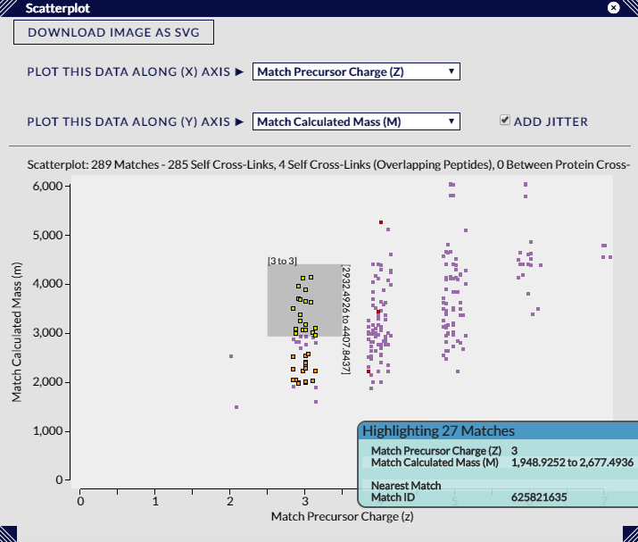

## Scatterplot ##

The scatterplot view displays the correlation of two chosen cross-link / match attributes in graphical form.

### Representation ###

Every filtered cross-link or match in the current dataset (which depends on the attributes chosen) is shown as a small square, coloured according to either the current colour scheme, or yellow if currently selected, or orange if currently highlighted. Decoys are also shown as unfilled (transparent) squares, which just have an outline. The title above the scatterplot details the current quantity of displayed cross-links / matches, and the categories into which they are divided by the current colour scheme (if the current colour scheme is a continuous scale it will default to the inter and intra-protein categories).

### Interaction ###

Moving the mouse pointer across the scatterplot displays details in a tooltip for those cross-links or matches within a set distance (usually about 20 pixels). Selection in this view is performed by left-clicking and dragging the mouse pointer to cover the ranges of the two attributes of interest. This selection action can be used in combination with the CTRL key to toggle selection states - selecting unselected elements and de-selecting currently selected elements.

### Options ###

The main controls for this view are the two "Plot this Data Along (X/Y)Axis" dropdowns which choose the metadata attribute to be distributed in the scatterplot - one for each axis. Like the histogram, the availability of these attributes fundamentally depends on the contents of the loaded search data though additional metadata can be added using the Load > Cross-Link Metadata dialog available through xiVIEW's top menu bar. If a PDB file has been loaded, then the Cross-Link Distances are available to plot as one of the options.

The "Add Jitter" toggle option decides whether to displace each square a small distance from its calculated position. This is useful for attributes with a small number of discrete values (e.g. Charge) where many representations would be overlaid at the same point. Turning jitter on gives a truer visual representation of the data density / distribution for these attributes.

As in other views, the "Download Image as SVG" button will download an SVG (vector format) file of the current state of the view. The filename will include information on search id and current filter settings.

