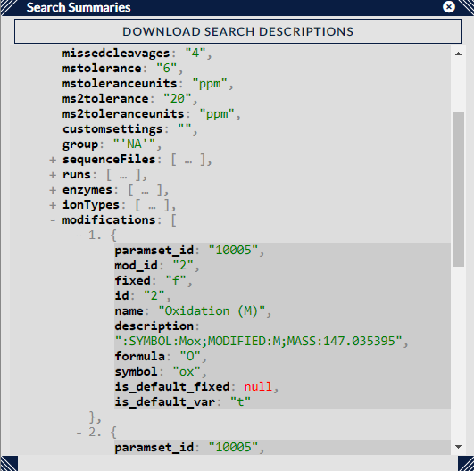

## Search Summary ##

### Representation ###

The search summary displays an expandable/collapsible tree of metadata associated with the searches currently loaded into Xi View. This offers a sanity check for users to see if the searches they're viewing do indeed use the files and settings they think it does.

### Options ###

For searches that include cross-linker and modification information (usually sourced from the Xi Search engine) a human-readable description of the search metadata can be downloaded by pressing the "Download Search Descriptions" button, often useful for publications / sharing with collaborators etc.

