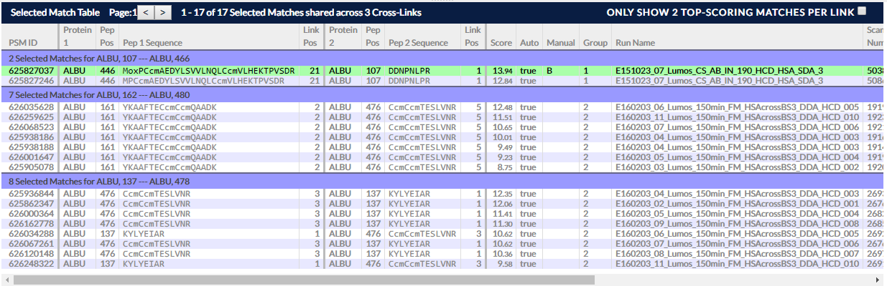

## Selected Match Table ##

In essence this is the bridge between making selections in a view and seeing raw data in the Spectrum View.

Selection of cross-links and/or matches in a view populates this paged table that fills the bottom part of the display above the filter bar - the height of the displayed area is adjustable with a draggable split pane widget. 

In the table, matches are shown as rows which are divided into groups according to the cross-link they belong to, with cross-links in turn sorted by the score of their highest-scoring match. Ambiguous matches are repeated in each cross-link they could belong to. The title bar of the table states the number of currently selected cross-links and matches with a paging widget for tabulating through large collections of selected matches.

Moving the mouse over a row will highlight the match in open views, and reciprocally, highlighting matches/links in views will highlight matches in the table. The table itself has a large number of columns showing data on each match and will generally require scrolling to view its full extent. 

The main purpose of the table is to allow selection of a single match (by left-clicking) which then prompts the Spectrum View to open and display the raw spectrum data supporting that match. If the Spectrum View is already open, making a new selection in a view (repopulating this table) will also automatically open the top match in the table in the Spectrum View.

### Options ###

Options here include the paging widget for tabulating to matches with lower scores, and an option "Only Show 2 Top-Scoring Matches Per Link" which is self-explanatory.

