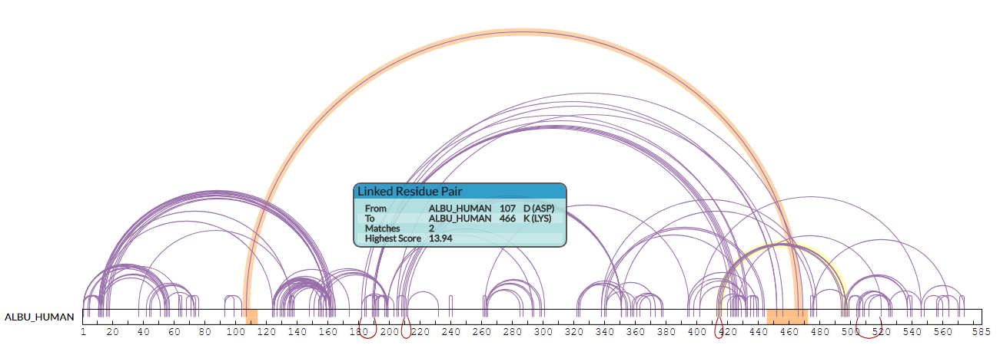

## XiNet View ##

<<<<<<< HEAD
The XiNet view displays cross-links as an interactive network visualisation - with the proteins as nodes shown as circles or elongated bars, and the cross-links as edges drawn between these nodes at the relevant positions.

RIGHT clicking at protein toggles it between its circular and bar representations.
=======
### Representation ###

The XiNet view displays a collection of cross-links between proteins as an interactive network visualisation - with the proteins (nodes) shown as circles or elongated bars and the cross-links as edges drawn between these nodes at the relevant positions.

### Interaction ###
>>>>>>> b720cfa0f3da303831d1b43c121f7813860aaf71

#### Selecting ####

Individual cross-links can be highlighted by moving the mouse pointer over them (plus a tooltip supplies details on the particular cross-link). Similarly, cross-links can be selected by using the left mouse button. In conjunction with the CTRL key, multiple cross-links can be selected (by clicking on unselected links) and currently selected cross-links can be unselected.

When the mouse pointer is over a protein itself a tooltip displays basic information (for more comprehensive data, use the selected proteins view), and it can be selected by left-clicking the mouse. When used with the CTRL key this also toggles this protein's selection on/off with the existing selection.

Clicking with the left mouse button on the background of the view will clear all selections for both cross-links and proteins.

#### Positioning ####

The position of the protein relative to the rest of the network can be changed by left-clicking on the protein representation and dragging it to a new position. Also, when the protein is represented as a bar, moving the mouse pointer to just beyond the left or rightmost edge of the bar will bring a circular icon into view. Now the protein representation can be rotated around its centre by left-clicking and dragging the mouse. This is useful for adjusting protein orientations within complex networks and making patterns of cross-linking clearer.

Using the right mouse button when over a self cross-link (a cross-link that has both ends within a protein), will flip all the self-links to the opposite side of the bar - often useful for visually disentangling these cross-links from inter-protein cross-links.

#### Scaling ####

The mouse wheel can be used to change the scale of inter-protein distances - it will shrink or expand the network as a whole, using the current mouse position as a centre point, but will not change the scale of individual protein representations. Individual protein size changes are instead achieved by using the right mouse button when over a protein: this pops up a menu with options allowing a local change in scale of the protein representation or collapsing the protein completely to a small circle. At the highest scale the protein's residue sequence becomes visible within the protein's bar representation.

### Options ###

The XiNet specific menu sits in the top-right of the XiView display and contains several options for tweaking or storing the current XiNet layout.

Firstly, the "Drag To Pan Or Select" radio button pair controls whether left-clicking the mouse and dragging on the XiNet background either a) pans the network around or b) draws a rectangle, within which any encroaching protein representations are selected when the mouse button is released.

The "Layout" portion of the menu allows the Saving and Loading of multiple layout configurations for each search - a time-saver in not needing to re-create preferred manual layouts from scratch. The "Auto" button will relayout the entire network using a built in layout algorithm from the cola.js layout library.

The "Download Image as SVG" button will download an SVG (vector format) file of the current state of the XiNet view. The filename will include information on search id and current filter settings.

Finally, the "Labels" checkbox turns off protein labels, often useful for large networks where a multitude of labels can obscure each other and other information.

### Reference ###

Combe, C. W., Fischer, L. & Rappsilber, J. [xiNET: Cross-link Network Maps With Residue Resolution](https://doi.org/10.1074/mcp.O114.042259 "DOI Link"). *Mol Cell Proteomics* 14, 1137–1147 (2015).
